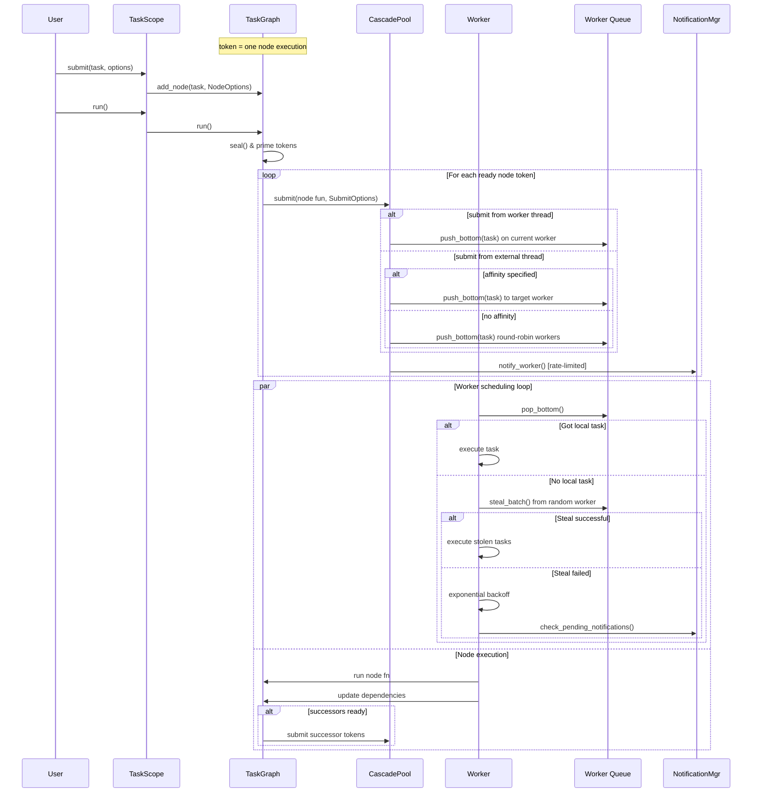

### Planned Architecture

How it will works:

### Why Not TBB/Other Runtimes(Goals of project)
Cascade is designed for scenarios where you need predictable performance, fine-grained control, and minimal overhead — without the complexity of general-purpose task systems.

### Key Differentiators

**1. Predictable Memory Usage**
- Lock-free arenas eliminate allocation contention
- Bounded queues prevent unbounded memory growth  
- QSBR reclamation provides safe memory management without stop-the-world pauses

**2. Fine-Grained Parallelism Control**
- Per-node concurrency limits with token-based execution
- Explicit back-pressure policies at every stage
- Affinity-aware task placement with hierarchical work stealing

**3. Minimal Overhead Architecture**
- Three-tier allocation: 3-5x faster than traditional allocators
- Batch operations: 60-80% reduction in synchronization overhead
- Cache-aware data structures optimized for modern CPUs

**4. Deterministic Scheduling**
- No hidden thread pools or global state
- Explicit DAG construction with cycle detection
- Predictable task lifetime management

**5. Integrated Memory Safety**
- QSBR-based reclamation throughout the stack
- No use-after-free even with early graph destruction
- Safe cross-thread memory management

### Use Cases

**Ideal For:**
- Real-time processing pipelines with known dependency graphs
- Simulation and game engines requiring predictable performance
- Data processing workflows with complex dependency patterns
- Embedded systems with strict memory constraints
- High-frequency trading and financial applications

**Less Suitable For:**
- Dynamic task spawning with unknown dependencies
- Applications requiring complex task priority hierarchies
- Scenarios where TBB's mature ecosystem is critical
- Legacy systems without C++20 support